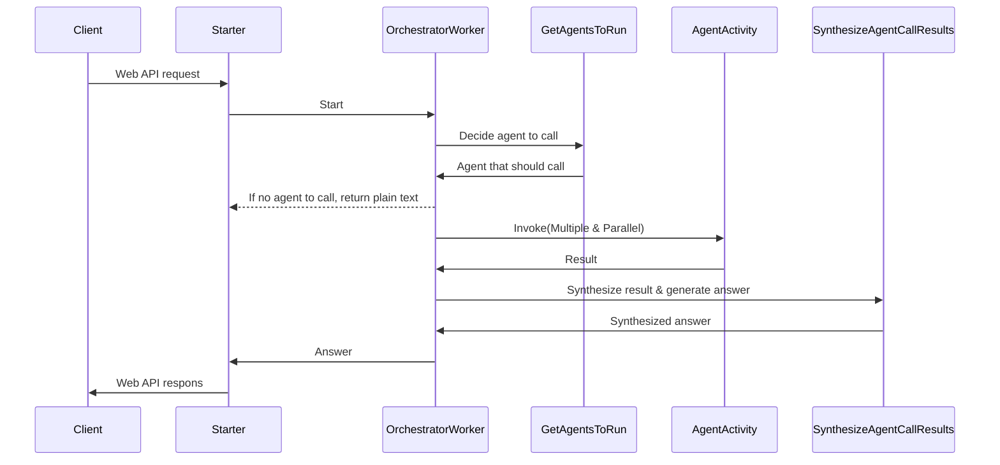

# Travel Concierge
This repository is a sample application for implementing the Orchestrator-Workers pattern introduced in Anthropic's blog "[Building effective agents](https://www.anthropic.com/research/building-effective-agents)" using Azure Durable Functions.

## Related Blog Posts
For more insights on building serverless AI agents using Durable Functions, check out Chris Gillum's blog post:
[Building Serverless AI Agents using Durable Functions on Azure](https://blog.cgillum.tech/building-serverless-ai-agents-using-durable-functions-on-azure-e1272882082c)

## Sequence Diagram
Case of synchronous endpoint:


## API Server
### 前準備
local.settings.json
```json
{
  "IsEncrypted": false,
  "Values": {
    "AzureWebJobsStorage": "UseDevelopmentStorage=true",
    "FUNCTIONS_WORKER_RUNTIME": "dotnet-isolated"
  }
}
```

secret.json
```json
{
  "Function": {
    "AzureOpenAIEndpoint": "https://xxx-xxx-eastus2.cognitiveservices.azure.com/",
    "AzureOpenAIApiKey": "xxx",
    "ModelDeploymentName": "gpt-4o"
  }
}
```

## Chat Client
### Create an environment using venv
```shell-session
$ cd chat-client
$ python -m venv .venv
```

### Activate environment
```shell-session
$ .venv\Scripts\activate.bat
```

### Install Streamlit in environment
```shell-session
$ pip install streamlit openai requests
```

### Run Streamlit app
```shell-session
$ streamlit run app.py
```

### Return to normal shell
```shell-session
$ deactivate
```
