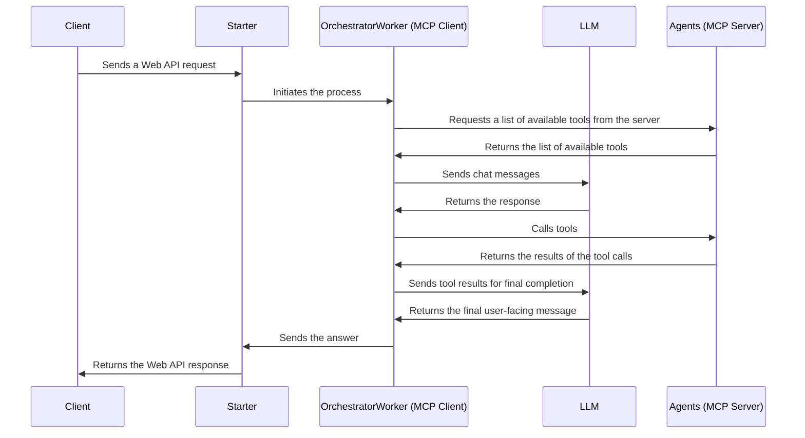

# Travel Concierge
This repository is a sample application for implementing the Orchestrator-Workers pattern introduced in Anthropic's blog "[Building effective agents](https://www.anthropic.com/research/building-effective-agents)" using Azure Functions MCP extension.

## Sequence Diagram
Case of synchronous endpoint:



## API Server
### Preparation
local.settings.json
```json
{
  "IsEncrypted": false,
  "Values": {
    "AzureWebJobsStorage": "UseDevelopmentStorage=true",
    "FUNCTIONS_WORKER_RUNTIME": "dotnet-isolated"
  }
}
```

secret.json
```json
{
  "Function": {
    "AzureOpenAIEndpoint": "https://xxx-xxx-eastus2.cognitiveservices.azure.com/",
    "AzureOpenAIApiKey": "xxx",
    "ModelDeploymentName": "gpt-4o",
    "MCPServerEndpoint": "http://localhost:xxxx/runtime/webhooks/mcp/sse",
    "MCPExtensionSystemKey": "xxx"
  }
}
```
### Azurite
```shell
$ docker run --rm -it -p 10000:10000 -p 10001:10001 -p 10002:10002 -v c:/azurite:/data mcr.microsoft.com/azure-storage/azurite:3.33.0
```

## Chat Client
### Create an environment using venv
```shell-session
$ cd chat-client
$ python -m venv .venv
```

### Activate environment
```shell-session
$ .venv\Scripts\activate.bat
```

### Install Streamlit in environment
```shell-session
$ pip install streamlit openai requests
```

### Run Streamlit app
```shell-session
$ streamlit run app.py
```

### Return to normal shell
```shell-session
$ deactivate
```
